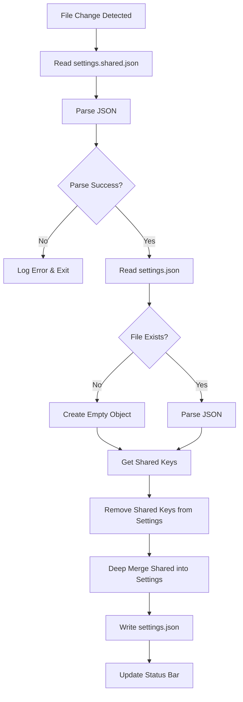

# VSCode Shared Settings Manager - Technical Specification

## Overview

A VSCode extension that automatically synchronizes shared team settings from `.vscode/settings.shared.json` into `.vscode/settings.json`, enabling teams to maintain consistent settings while preserving individual developer preferences.

## Core Requirements

### Functional Requirements

1. **File Watching**
   - Monitor `.vscode/settings.shared.json` for changes using VSCode's FileSystemWatcher
   - Trigger sync operation on file save/modification
   - Handle file creation, modification, and deletion events

2. **Settings Synchronization**
   - Read current `settings.json` content
   - Remove all keys from `settings.json` that exist in `settings.shared.json` (cleaning step)
   - Deep merge `settings.shared.json` into cleaned `settings.json`
   - Write updated content back to `settings.json`
   - Preserve JSON formatting and comments where possible

3. **Merge Strategy**
   - **Deep Merge**: Recursively merge nested objects
   - Shared settings completely overwrite existing values at leaf level
   - Arrays are replaced, not merged
   - Example:
     ```
     settings.json:        { "editor": { "fontSize": 14, "tabSize": 2 } }
     settings.shared.json: { "editor": { "fontSize": 16 } }
     Result:               { "editor": { "fontSize": 16, "tabSize": 2 } }
     ```

4. **Activation Behavior**
   - Auto-activate when workspace contains `.vscode/settings.shared.json`
   - Perform initial sync immediately on activation
   - Remain dormant if shared settings file doesn't exist

5. **Error Handling**
   - Create `settings.json` if it doesn't exist
   - Handle JSON parse errors gracefully
   - Log errors to VSCode output channel
   - Continue operation even if individual sync fails

6. **User Feedback**
   - Silent operation by default
   - Optional status bar indicator showing:
     - Last sync timestamp
     - Sync status (success/error)
     - Click to view output logs

## Technical Architecture

### Project Structure

```
VSCodeExt_SharedSettingsManager/
├── src/
│   ├── extension.ts          # Extension entry point, activation logic
│   ├── settingsManager.ts    # Core sync orchestration
│   ├── utils/
│   │   ├── deepMerge.ts      # Deep merge utility
│   │   └── removeKeys.ts     # Key removal utility
│   └── statusBar.ts          # Status bar indicator
├── package.json              # Extension manifest
├── tsconfig.json             # TypeScript configuration
├── README.md                 # User documentation
├── .vscodeignore            # Package exclusions
└── SPECIFICATION.md          # This file
```

### Key Components

#### 1. Extension Activation (`extension.ts`)
```typescript
export function activate(context: vscode.ExtensionContext) {
  // Check for settings.shared.json existence
  // Perform initial sync if exists
  // Setup FileSystemWatcher
  // Initialize status bar
  // Register disposables
}
```

#### 2. Settings Manager (`settingsManager.ts`)
```typescript
class SettingsManager {
  async syncSettings(): Promise<void>
  private async readSharedSettings(): Promise<object>
  private async readSettings(): Promise<object>
  private async writeSettings(content: object): Promise<void>
}
```

#### 3. Utilities
- `deepMerge(target, source)`: Recursively merge objects
- `removeKeys(obj, keysToRemove)`: Remove specified keys from object

### Activation Events

```json
{
  "activationEvents": [
    "workspaceContains:.vscode/settings.shared.json"
  ]
}
```

## Implementation Details

### Deep Merge Algorithm

```typescript
function deepMerge(target: any, source: any): any {
  if (!isObject(source)) return source;
  
  const result = { ...target };
  
  for (const key in source) {
    if (isObject(source[key]) && isObject(target[key])) {
      result[key] = deepMerge(target[key], source[key]);
    } else {
      result[key] = source[key];
    }
  }
  
  return result;
}
```

### Key Removal Algorithm

```typescript
function removeKeys(obj: any, keysToRemove: string[]): any {
  const result = { ...obj };
  
  for (const key of keysToRemove) {
    delete result[key];
  }
  
  return result;
}
```

### Sync Flow



## Testing Scenarios

1. **New Workspace**
   - No existing `settings.json`
   - Should create new file with shared settings

2. **Existing Settings**
   - `settings.json` has personal preferences
   - Should preserve non-shared settings
   - Should overwrite shared settings

3. **Nested Objects**
   - Deep merge should work correctly
   - Leaf values should be replaced
   - Non-conflicting nested keys preserved

4. **Missing Files**
   - Handle missing `settings.shared.json` gracefully
   - Handle missing `settings.json` by creating it

5. **Invalid JSON**
   - Malformed `settings.shared.json`
   - Should log error and not corrupt `settings.json`

6. **Concurrent Modifications**
   - Multiple rapid changes to shared file
   - Should debounce and sync once

## Configuration Options

Future enhancement: Allow users to configure:
- Status bar visibility
- Sync debounce delay
- Custom shared settings filename
- Notification preferences

## Dependencies

- `vscode`: VSCode Extension API
- TypeScript 5.x
- No external runtime dependencies

## Performance Considerations

- File operations are async to avoid blocking UI
- Debounce file watcher events (300ms default)
- JSON parsing errors don't crash extension
- Minimal memory footprint (no caching)

## Security Considerations

- Only operates within workspace `.vscode` folder
- No network operations
- No external file access
- Respects VSCode file permissions

## Future Enhancements

1. Conflict resolution UI
2. Sync history/undo
3. Multi-file shared settings support
4. Settings validation schema
5. Team settings templates
6. Git integration for shared settings